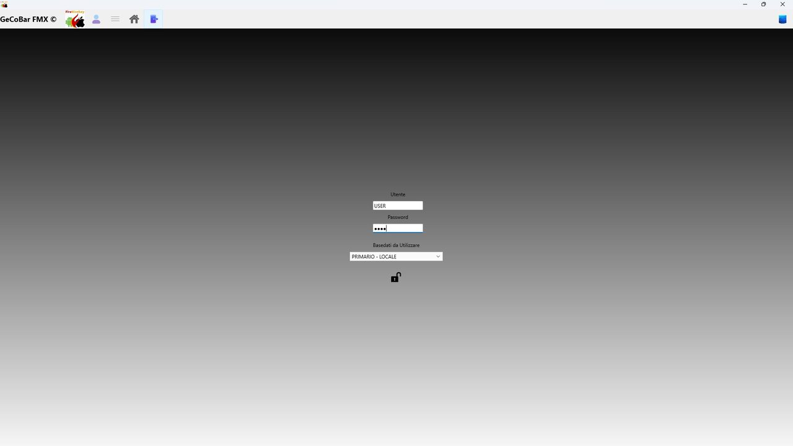

# 2. Accesso e sicurezza

All'avvio l'operatore sceglie se connettersi al database locale o a quello Azure, inserisce le proprie credenziali e accede al sistema. L'autenticazione è protetta: le password sono cifrate nel database con algoritmo 3DES e il sistema gestisce profili utente con livelli di accesso differenziati — alcune funzioni sono visibili solo agli utenti con privilegi elevati.

*Fig. 1 — Schermata di accesso e autenticazione*

Il software è protetto da un sistema di licenza a doppio livello (3DES + RSA) legato all'hardware specifico della macchina su cui è installato: numero seriale del disco, identificativo del processore e nome del computer. Questo impedisce l'utilizzo non autorizzato su altre macchine.

La connessione ad Azure prevede un meccanismo automatico di retry con fino a tre tentativi, utile quando il database cloud sia in fase di avvio. In caso di tre tentativi falliti, il sistema mostra un messaggio di errore chiaro con il dettaglio tecnico.
