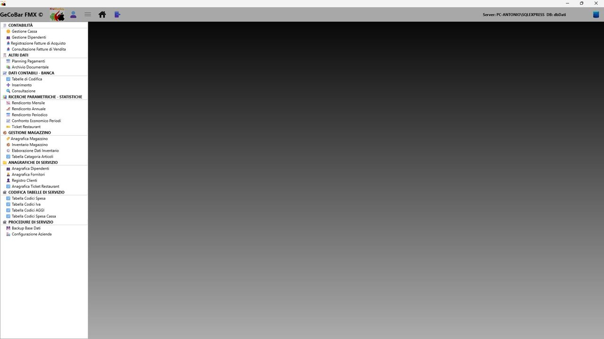

# 3. Struttura dell'applicazione

Una volta effettuato il login, l'operatore accede a un menu laterale a pannello scorrevole, organizzato per aree funzionali. Selezionando una voce, il contenuto principale della finestra viene sostituito dal modulo corrispondente, che si apre con una leggera animazione. I moduli disponibili coprono le seguenti aree:

- Cassa giornaliera — il modulo operativo principale, descritto in dettaglio nel capitolo successivo.
- Consultazioni e Statistiche — analisi dei dati storici in vista mensile, annuale e periodica.
- Statistiche — cruscotto sintetico di lettura rapida con confronto multi-anno.
- Appuntamenti e Contabilità — fatture fornitori, fatture clienti, planning finanziario, movimenti bancari.
- Dipendenti — anagrafica, competenze mensili e pagamenti del personale.
- Gestione documentale — archiviazione digitale di documenti con scansione diretta e viewer PDF.
- Magazzino — anagrafica articoli, inventario e elaborazione dati di fine anno.
- Anagrafiche di servizio — clienti, fornitori, compagnie ticket.
- Tabelle di configurazione — codici IVA, codici spesa, aggi e provvigioni.
- Procedure di servizio — backup e dati aziendali.

*Fig. 2 — Menu laterale con tutte le aree funzionali*
