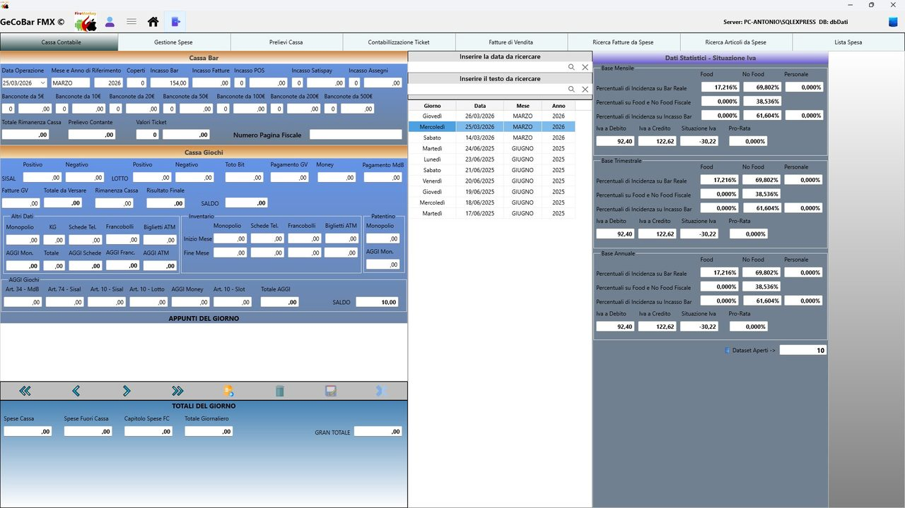
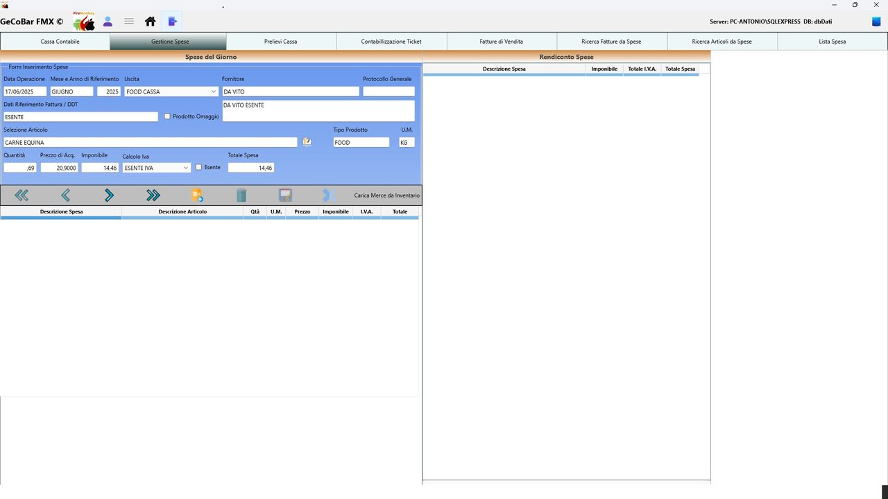
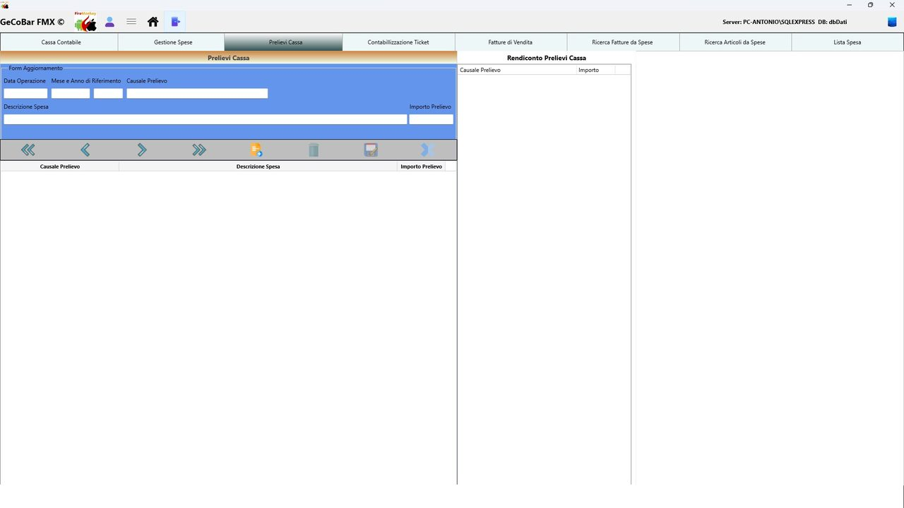
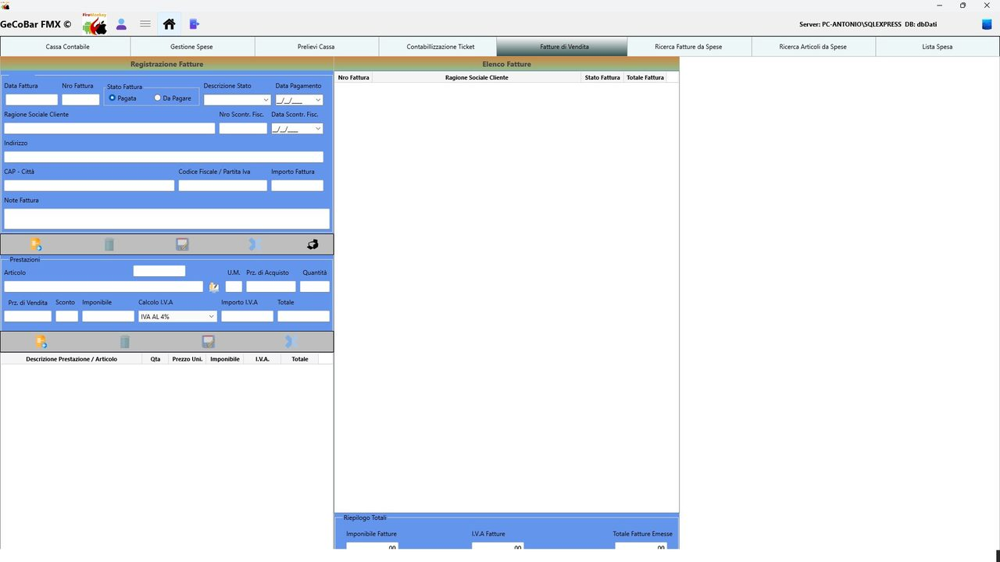
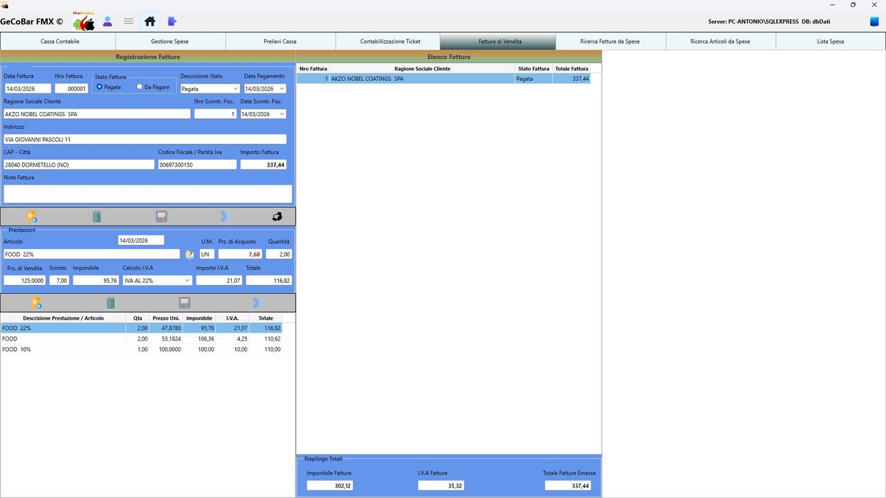
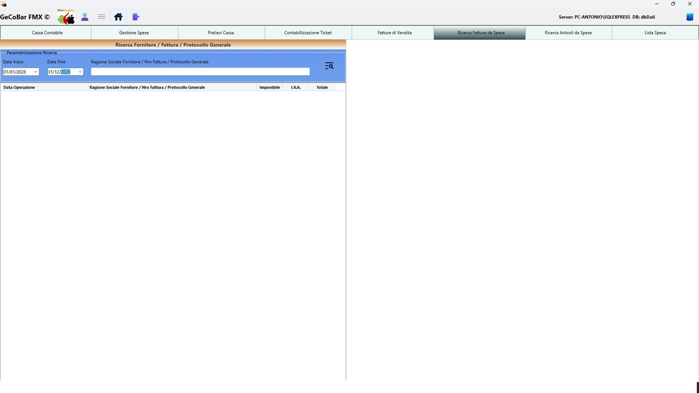
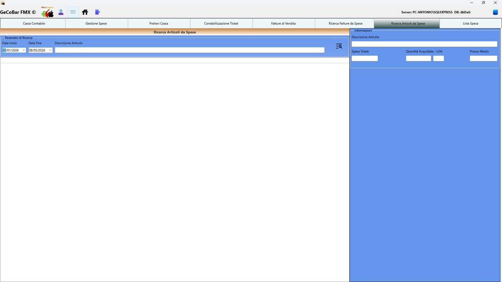
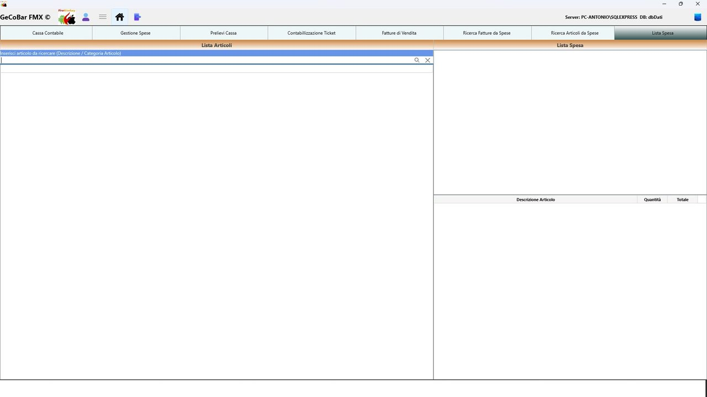

# 4. Modulo Cassa giornaliera

Il Modulo Cassa è il cuore operativo dell'applicazione. Permette al titolare di registrare, controllare e analizzare tutto ciò che accade economicamente nel locale ogni giorno: dagli incassi al banco, alle spese per la merce, ai prelievi di cassa, fino all'emissione di fatture di vendita. Si apre automaticamente posizionandosi sulla data odierna e carica le statistiche aggiornate.

Il modulo si presenta come una schermata a schede (tab), ognuna dedicata a una funzione specifica. L'applicazione apre solo i dati necessari per la sezione attiva, mantenendo le prestazioni elevate anche su database con anni di storico.

## Schede disponibili

### 1. Cassa giornaliera

La scheda principale. Si inserisce la data e la maschera mostra o crea la registrazione della giornata. Vengono tracciati: il contante suddiviso per taglio di banconota (da 5€ a 500€), i pagamenti con POS su due circuiti distinti, gli assegni, i ticket restaurant, i prelievi, le spese e i totali calcolati automaticamente. Il sistema verifica che non esista già una cassa per quella data prima di consentire l'inserimento, prevenendo i doppioni. Al salvataggio, i dati mensili, il saldo progressivo e le statistiche si aggiornano in automatico, senza che l'operatore debba fare nulla di manuale.

*Fig. 3 — Cassa giornaliera con pannello statistiche IVA*

Sono presenti anche tutti i campi relativi ai prodotti in concessione (monopolio, francobolli, schede telefoniche, biglietti ATM) con calcolo automatico degli aggi in base alle percentuali configurate e alla data di decorrenza.

### 2. Spese di cassa

Registro di tutte le spese sostenute: acquisto merce, forniture, materie prime. Per ogni riga si indicano l'articolo, il fornitore, la quantità, il prezzo, l'aliquota IVA e l'eventuale riferimento fattura. Il sistema calcola automaticamente imponibile, IVA e totale riga. È prevista la gestione degli omaggi (flag omaggio) e delle merci in esenzione IVA. Alla conferma di ogni spesa, il prezzo di acquisto dell'articolo nel magazzino viene aggiornato automaticamente. Se si sta lavorando su una fattura dello stesso fornitore, il sistema mantiene in memoria i riferimenti e propone automaticamente i dati nella riga successiva.

*Fig. 4 — Gestione Spese del giorno*

### 3. Prelievi di cassa

Tracciamento di ogni prelievo di denaro dalla cassa, con causale selezionabile da un elenco predefinito e importo. Ogni prelievo aggiorna il saldo di cassa in tempo reale tramite stored procedure sul database.

*Fig. 5 — Prelievi di cassa con rendiconto per causale*

### 4. Ticket Restaurant

Gestione dell'incasso tramite buoni pasto. Si seleziona la compagnia emittente, si inserisce il numero di ticket e il taglio; il sistema calcola automaticamente le commissioni trattenute e il netto incassato, attingendo alle percentuali configurate per ciascuna compagnia nell'anagrafica.

### 5. Fatture di vendita

Registro completo delle fatture emesse verso clienti. Ogni fattura include intestazione cliente (ricercabile con autocompletamento), righe articolo con calcolo automatico di imponibile, IVA e totale, stato di pagamento, riferimento allo scontrino fiscale e note. Le fatture sono stampabili direttamente dall'applicazione con layout professionale completo di castelletto IVA e dati aziendali. Il numero fattura viene assegnato automaticamente come progressivo annuale.

*Fig. 6 — Fatture di vendita — maschera di inserimento*

*Fig. 7 — Fatture di vendita — esempio con righe e totali*

### 6. Ricerca spese per fornitore/categoria

Strumento di analisi che permette di filtrare le spese per periodo e descrizione, ottenendo un riepilogo aggregato per voce di spesa con totali di imponibile, IVA e importo complessivo. Il range massimo di ricerca è 365 giorni.

*Fig. 8 — Ricerca spese per fornitore/fattura/protocollo*

### 7. Ricerca articoli acquistati

Consente di cercare un articolo specifico e vedere, per un intervallo di date scelto, tutti gli acquisti effettuati: quantità totale, spesa totale e prezzo medio ponderato. Cliccando su un articolo nel risultato, si ottiene il dettaglio di ogni singolo acquisto registrato.

*Fig. 9 — Ricerca articoli da spese*

### 8. Lista della spesa

Strumento operativo per preparare l'ordine ai fornitori. L'operatore cerca gli articoli, inserisce le quantità desiderate, e la lista viene salvata e stampabile. È possibile trasferire la lista direttamente nelle spese di cassa con un click, velocizzando l'inserimento degli acquisti abituali.

*Fig. 10 — Lista della spesa*

## Funzionalità trasversali

Statistiche automatiche. Ad ogni salvataggio della cassa giornaliera, l'applicazione ricalcola in background le statistiche mensili, trimestrali e annuali senza intervento manuale.

Carico merce da inventario. Con un'unica operazione è possibile importare la merce rilevata in inventario direttamente come spesa di cassa, con aggiornamento automatico del magazzino e barra di avanzamento.

Autocompletamento intelligente. In tutti i campi principali — fornitore, articolo, cliente, causale prelievo, riferimento fattura — basta iniziare a digitare per vedere comparire un elenco filtrato con i suggerimenti pertinenti.

Inserimento articoli al volo. Se durante una registrazione di spesa o una riga fattura si ha bisogno di un articolo non ancora in archivio, è possibile crearlo direttamente dalla maschera corrente senza perdere il contesto di lavoro.

Controlli di integrità. Il sistema blocca il salvataggio se mancano dati obbligatori, previene i doppioni per data, avvisa prima di eliminare una cassa e gestisce correttamente la navigazione tra le schede.

Stampa fatture. Le fatture di vendita sono stampabili con un click, con layout che include intestazione aziendale, righe articolo, castelletto IVA riepilogativo e tutti i riferimenti fiscali necessari.
