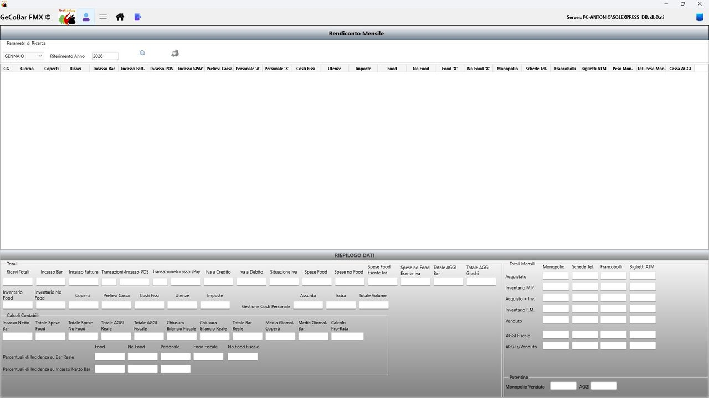
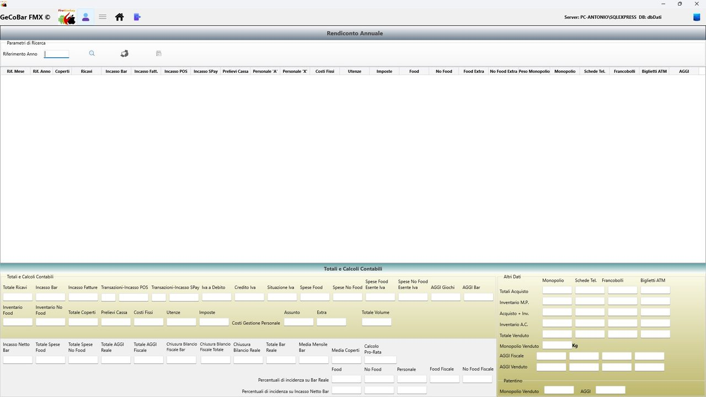
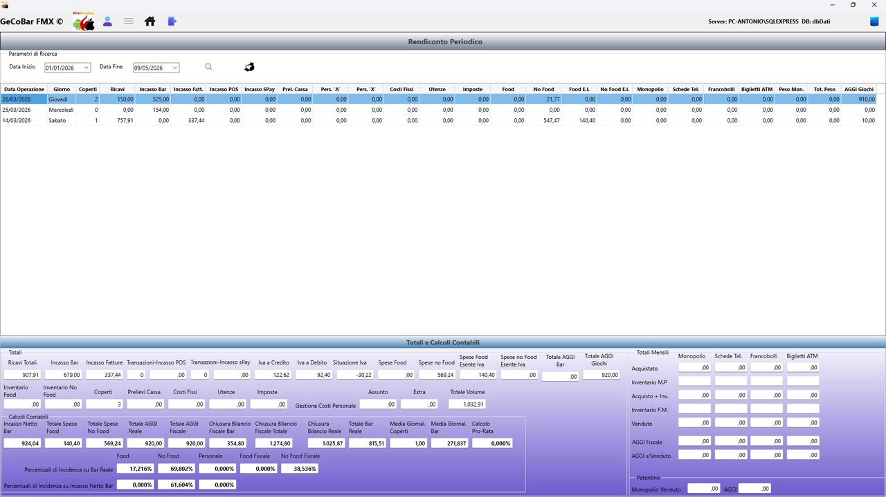

# 5. Modulo Consultazioni e Statistiche

Il Modulo Consultazioni è il centro di analisi dell'applicazione. Mentre il Modulo Cassa serve per registrare i dati quotidiani, questo modulo serve per leggerli, interpretarli e confrontarli nel tempo. Permette al titolare di avere in ogni momento un quadro economico completo del locale, organizzato per mese, per anno o per qualsiasi periodo personalizzato.

Il modulo si articola in tre viste principali, selezionabili dal menu:

## Vista Mensile

Mostra il riepilogo economico di un singolo mese. L'operatore seleziona il mese e l'anno di interesse e la maschera presenta in modo strutturato tutti gli indicatori della gestione.

Ricavi e incassi: totale incassi bar, IVA a debito, fatture emesse, incasso netto, calcolo pro-rata IVA.

Merci acquistate: separazione tra Food e NoFood, con ulteriore distinzione tra acquisti con IVA ordinaria e in esenzione IVA. Vengono mostrati anche i movimenti di inventario mensile.

Prodotti in concessione: per ciascuna categoria (monopolio/sigarette, francobolli, schede telefoniche, biglietti ATM) vengono mostrati acquistato, venduto, differenza inventario e aggio netto calcolato automaticamente.

Costi operativi: personale assunto, personale extra, utenze, imposte, costi fissi — ciascuno con dettaglio analitico accessibile con doppio click.

Indicatori sintetici: media giornaliera degli incassi, media per coperto, margine lordo, risultato finale del mese.

*Fig. 11 — Rendiconto Mensile — struttura della vista*

## Vista Annuale

Identica per struttura alla vista mensile, ma con orizzonte esteso all'intero anno. Mostra gli stessi indicatori aggregati su tutti i mesi dell'anno selezionato. Per i prodotti in concessione, integra i dati dell'inventario di fine anno per il calcolo del venduto reale come differenza tra acquistato e giacenza finale.

*Fig. 12 — Rendiconto Annuale — struttura della vista*

## Vista Periodica

La più flessibile delle tre. Permette di selezionare liberamente una data di inizio e una data di fine (fino a un massimo di 365 giorni) e ottenere tutti gli stessi indicatori calcolati su quel preciso intervallo. È utile per analisi specifiche che non coincidono con i confini del mese o dell'anno.

*Fig. 13 — Rendiconto Periodico — struttura della vista*

## Dettaglio spese — sottoframe integrato

In tutte e tre le viste, le sezioni relative alle spese si aprono in un pannello dedicato che mostra la lista delle singole voci registrate nel periodo, il dettaglio degli articoli acquistati per ciascuna voce e i totali di imponibile, IVA e importo complessivo per categoria. Questo permette di passare in pochi click dal dato sintetico al dato analitico.
