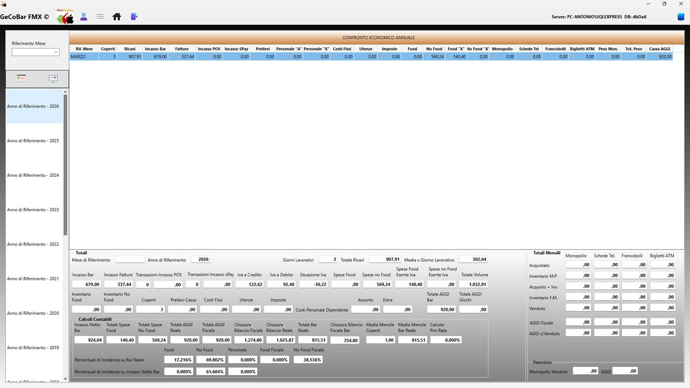

# 6. Modulo Statistiche

Il Modulo Statistiche è il cruscotto di sintesi dell'intera attività. A differenza del Modulo Consultazioni — che è uno strumento di analisi interattiva — questo modulo è una vista strutturata e sempre visibile che mostra, in un'unica schermata compatta, tutti gli indicatori economici del locale organizzati per macro-area.

## Selezione del periodo e degli anni

All'apertura il modulo mostra una lista di tutti gli anni per cui esistono dati nel database, costruita dinamicamente. L'operatore seleziona l'anno di interesse e la schermata si aggiorna immediatamente. Per la modalità mensile si seleziona anche il mese tramite un campo a tendina. Cliccando su un anno diverso nella lista, la schermata si aggiorna istantaneamente permettendo il confronto immediato tra anni.

*Fig. 14 — Confronto Economico Annuale — lista anni e indicatori*

## Struttura della schermata

La schermata è organizzata in quattro gruppi di indicatori, tutti visibili contemporaneamente:

- Ricavi e incassi — totale generale, incasso bar, IVA, spese Food/NoFood, utenze, imposte, costi fissi, personale, coperti, POS, prelievi, fatturato.
- Prodotti in concessione — per ogni categoria (monopolio, francobolli, schede, biglietti ATM): acquistato, venduto, differenza inventario al prezzo di carico e al prezzo di vendita, aggio netto, peso monopolio.
- Aggi e giochi — Art. 34 MDB, Art. 74 Sisal, Art. 10 per categoria, totale aggi giochi, aggi monopolio/schede/francobolli/ATM, incasso bar netto.
- Indicatori di sintesi — cassa AGI, numero fatture emesse, pagamenti Sati/Spay.

## Collegamento con il dettaglio spese

Anche nel Modulo Statistiche i valori della schermata mensile sono interattivi: facendo doppio click su una voce di spesa si apre il pannello di dettaglio con la lista analitica di tutte le registrazioni che compongono quel valore, esattamente come nel Modulo Consultazioni. Il doppio click funziona anche per il dettaglio dipendenti e per i prelievi di cassa.

## Differenza rispetto al Modulo Consultazioni

Il Modulo Consultazioni è uno strumento di navigazione analitica orientato all'analisi approfondita e alla verifica, tipicamente usato con il commercialista. Il Modulo Statistiche è un cruscotto di sintesi orientato alla lettura rapida quotidiana o settimanale, quando il titolare vuole semplicemente sapere "come sta andando".
