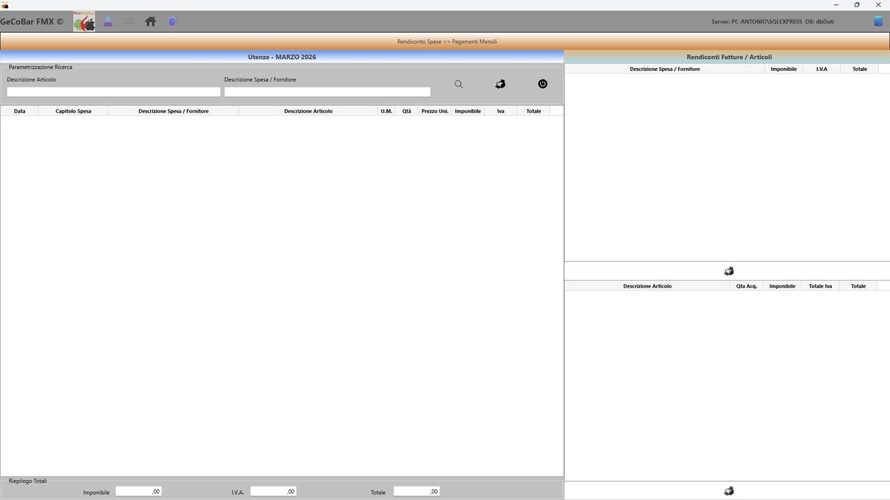
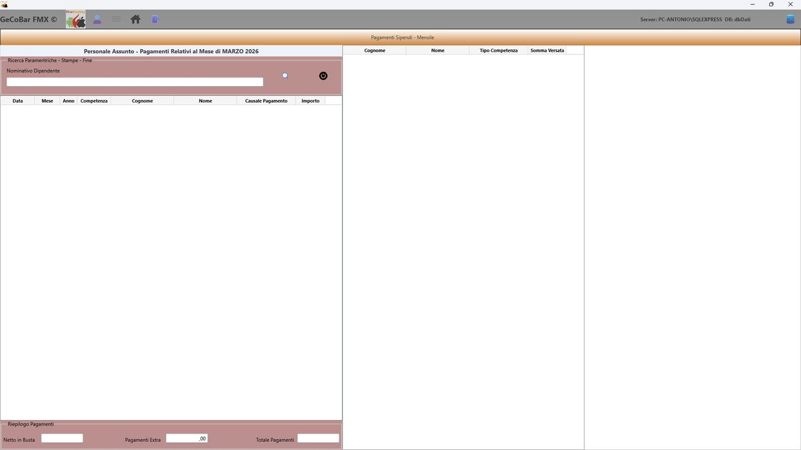
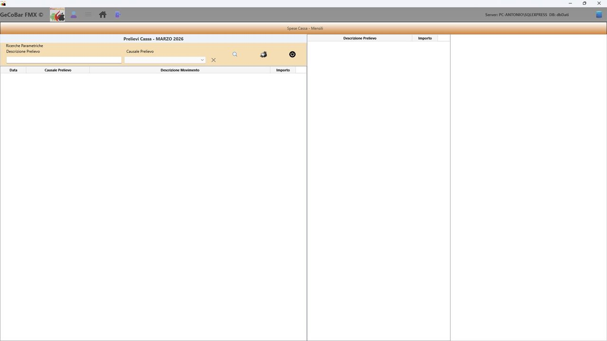
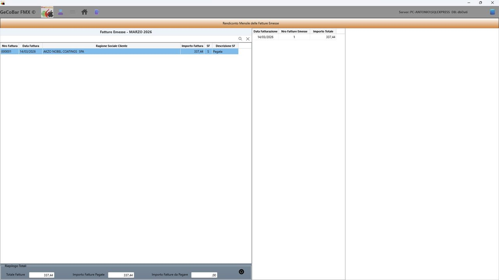
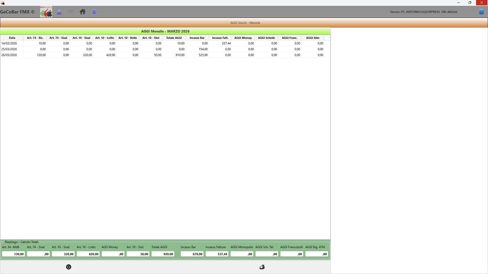

# 7. Analisi di dettaglio — la navigazione dal dato sintetico al particolare

Nel Modulo Consultazioni e nel Modulo Statistiche, i valori mostrati non sono semplici numeri statici: sono campi interattivi. Quando l'operatore fa doppio click su uno dei valori sintetici, l'applicazione apre automaticamente un pannello di dettaglio sovrapposto che mostra il dato disaggregato, riga per riga.

Il pannello di dettaglio si adatta automaticamente al contesto temporale della consultazione da cui viene aperto: nelle viste mensile e annuale mostra i dati aggregati per il mese o l'anno selezionato, nella vista periodica mostra i dati relativi all'intervallo di date scelto. Chiuso il pannello, si torna esattamente alla vista di partenza.

## Dettaglio spese (Food, NoFood, Utenze, Imposte, Costi fissi)

Facendo doppio click su una voce di spesa si apre un pannello con tre viste:

- Lista singole registrazioni — ogni riga di spesa registrata nel periodo, con data, descrizione, articolo, quantità, prezzo unitario, imponibile, IVA e totale. Filtrabile per descrizione articolo o categoria.
- Riepilogo per voce di spesa — le stesse spese raggruppate per categoria con totali aggregati. Base per la stampa del report delle spese.
- Riepilogo per articolo — spese raggruppate per articolo acquistato, con quantità totale, importo totale e IVA.

Dalla stessa finestra sono disponibili i pulsanti di stampa per il report delle spese raggruppate per voce e per il report degli articoli acquistati.

*Fig. 16 — Dettaglio spese Food mensili*

*Fig. 17 — Dettaglio spese Utenze mensili — stessa struttura per ogni categoria*

Le stesse viste sono disponibili in versione annuale, periodica e nelle statistiche multi-anno, con identica struttura e funzionalità di ricerca, filtro e stampa.

## Dettaglio personale dipendenti

Facendo doppio click sulla voce costo del personale si apre il pannello con i movimenti paga del periodo per ogni dipendente (filtrabile per cognome), il netto in busta con la distinzione tra competenza fissa e compensi extra, e il report dipendenti stampabile.

*Fig. 18 — Dettaglio personale dipendenti mensili*

Le stesse viste sono disponibili in versione annuale, periodica e nelle statistiche multi-anno, con identica struttura e funzionalità di ricerca, filtro e stampa.

## Dettaglio prelievi di cassa

Lista di ogni prelievo del periodo con data, causale e importo. Filtrabile per causale tramite selettore a tendina. Totale del periodo sempre aggiornato. Stampa del report disponibile.

*Fig. 19 — Dettaglio prelievi di cassa mensili*

Le stesse viste sono disponibili in versione annuale, periodica e nelle statistiche multi-anno, con identica struttura e funzionalità di ricerca, filtro e stampa.

*Fig. 20 — Dettaglio fatture emesse mensili*

Le stesse viste sono disponibili in versione annuale, periodica e nelle statistiche multi-anno, con identica struttura e funzionalità di ricerca, filtro e stampa.

## Dettaglio aggi e giochi

Pannello con tutte le componenti degli aggi maturati nel periodo: Art. 34 MDB, Art. 74 Sisal, Art. 10 per categoria, totale aggi giochi, aggio monopolio, schede telefoniche, francobolli, biglietti ATM. Disponibile in versione mensile e annuale con totali cumulativi.

*Fig. 21 — Dettaglio aggi e giochi mensili*

Le stesse viste sono disponibili in versione annuale, periodica e nelle statistiche multi-anno, con identica struttura e funzionalità di ricerca, filtro e stampa.

## Dettaglio fatture emesse

Elenco fatture del periodo con data, numero formattato a sei cifre, cliente, importo e stato. Filtro per ragione sociale. Totali riepilogatori fissi: fatturato emesso, già incassato, ancora da incassare. Stampa del report disponibile.
