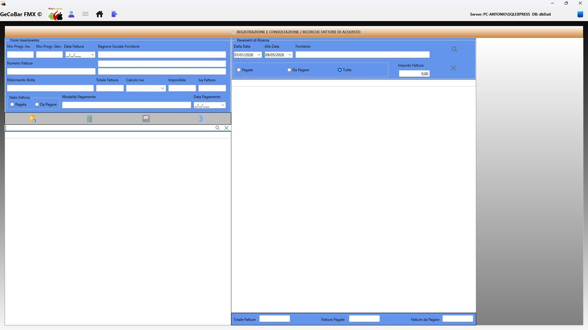
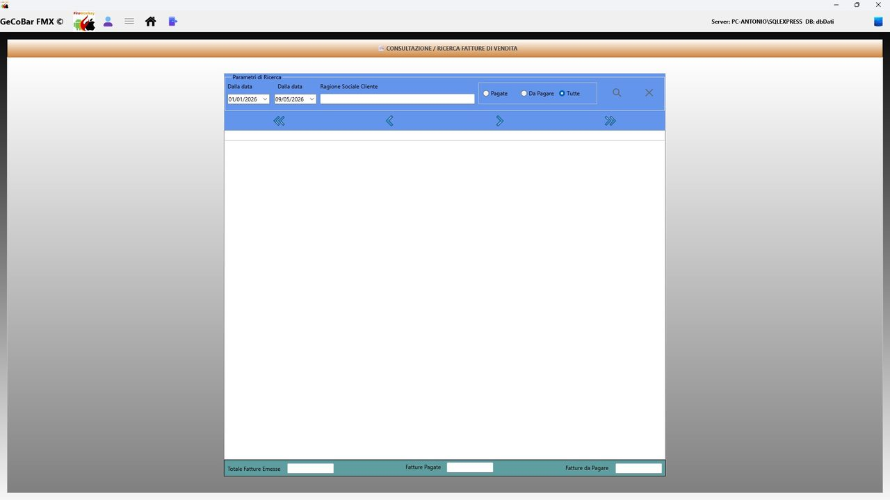

# 8. Modulo Appuntamenti e Contabilità

Raccoglie tutti gli strumenti di supporto alla gestione finanziaria e amministrativa che vanno al di là della cassa quotidiana: fatture ricevute dai fornitori, monitoraggio pagamenti, fatture emesse ai clienti, pianificazione delle uscite future e registro dei movimenti bancari.

## 1. Registro fatture di acquisto

Registrazione e gestione delle fatture ricevute dai fornitori. Per ogni fattura: fornitore (con autocompletamento), numero e data fattura, importo totale, aliquota IVA con calcolo automatico di imponibile e IVA, data di pagamento e stato (pagata/non pagata). Il sistema assegna automaticamente il numero progressivo annuale. Ricerca per testo libero in tempo reale.

*Fig. 22 — Registrazione e consultazione fatture di acquisto*

## 2. Consultazione fatture di acquisto

Ricerca parametrica sulle fatture dei fornitori per periodo, stato e fornitore/importo. Tre totali sempre visibili e aggiornati: totale fatture nel periodo, totale pagate, totale non ancora pagate.

## 3. Consultazione fatture di vendita

Speculare alla sezione precedente ma orientata alle fatture emesse verso clienti. Ricerca per periodo e stato di pagamento. Totali: fatturato emesso, incassato, ancora da incassare.

*Fig. 23 — Consultazione fatture di vendita*

## 4. Planning finanziario

Registro libero di movimenti finanziari futuri o presenti per pianificare uscite e entrate attese. Ogni voce riporta data, causale, importo e stato (pagato/non pagato). Tre totali calcolati in tempo reale: totale movimenti, già pagato, ancora da pagare.

## 5. Movimenti bancari

Registro dei movimenti del conto corrente aziendale. Ogni movimento riporta data, causale da elenco configurabile, conto di riferimento, importo, numero documento e descrizione. Flag contabilizzato/non contabilizzato per la riconciliazione con l'estratto conto. Ricerca per periodo e per conto.
