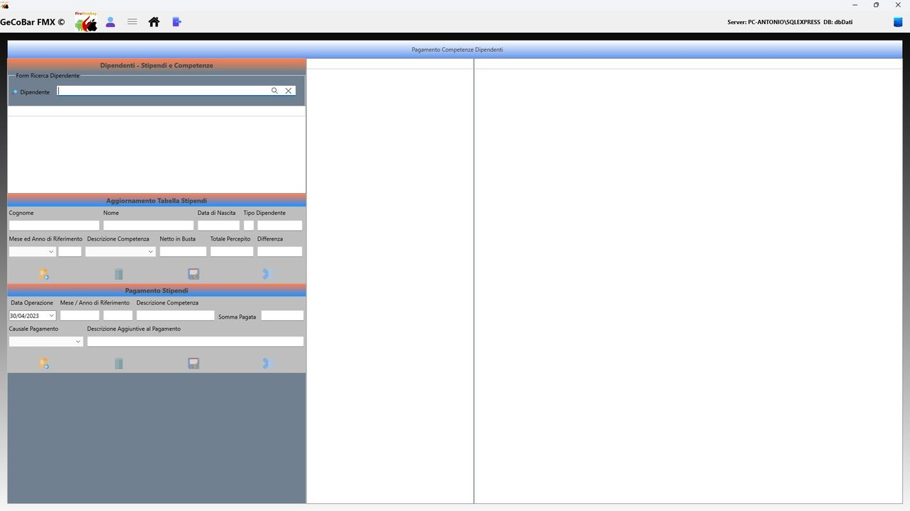

# 9. Modulo Dipendenti

Gestisce tutto ciò che riguarda il personale dell'attività: i dati anagrafici di ogni dipendente, le competenze maturate mese per mese e i pagamenti effettuati. Tiene sotto controllo quanto si deve a ciascun dipendente in ogni momento, con un saldo sempre aggiornato.

## 1. Anagrafica dipendenti

Archivio completo del personale. Per ogni dipendente: cognome, nome, data e luogo di nascita (con ricerca del comune per codice Belfiore), sesso, codice fiscale, indirizzo, telefono, email, IBAN e tipo di dipendente (assunto a tempo indeterminato oppure personale extra). La distinzione tra assunto ed extra è rilevante per la classificazione dei costi nelle statistiche.

Una barra di ricerca filtra l'elenco per nome o cognome. Il sistema verifica prima del salvataggio che tutti i campi obbligatori siano compilati, segnalando con messaggio chiaro quale campo manca.

## 2. Gestione competenze e pagamenti

Questa è la sezione operativa del modulo Dipendenti. Mese per mese, l'operatore registra le competenze maturate da ciascun dipendente e i pagamenti effettuati nei suoi confronti. La struttura a doppia registrazione — competenze da un lato, pagamenti dall'altro — è il punto di forza del modulo: consente di tenere separati il credito maturato dal dipendente e il debito effettivamente saldato dal datore di lavoro, evidenziando in ogni momento l'eventuale saldo residuo ancora da liquidare.

Ricerca e selezione del dipendente. Per avviare qualsiasi operazione è necessario selezionare il dipendente di interesse. La ricerca avviene tramite una barra di testo a ricerca immediata: digitando anche solo le prime lettere del cognome o del nome, il sistema filtra istantaneamente l'elenco dei dipendenti registrati in anagrafica. Una volta selezionato il nominativo, la schermata mostra automaticamente i dati identificativi principali — cognome, nome, data di nascita e tipo di dipendente (assunto a tempo indeterminato, part-time, extra, collaboratore occasionale) — e si predispone per l'inserimento delle competenze o dei pagamenti.

Registrazione delle competenze mensili. Per ogni mese e anno di riferimento si possono registrare una o più voci di competenza, ciascuna corrispondente a un tipo diverso di emolumento. Il tipo di competenza viene scelto da un archivio di codici configurabile, che può comprendere voci come: busta paga ordinaria, straordinario, tredicesima mensilità, quattordicesima mensilità, Trattamento di Fine Rapporto (TFR), rimborso spese, indennità varie, premi di produzione, o qualsiasi altra voce retributiva prevista dal contratto individuale o collettivo applicato. Per ogni voce si inseriscono due importi distinti:

— Netto in busta: l'importo netto che il dipendente percepisce effettivamente per quella specifica voce di competenza nel mese indicato, ovvero la somma al netto di tutte le trattenute fiscali e previdenziali a carico del lavoratore (IRPEF, contributi INPS, addizionali, ecc.).

— Totale percepito: l'importo complessivo della competenza, comprensivo di eventuali voci aggiuntive, rimborsi forfettari, benefit monetizzati o trattenute particolari che modificano la somma rispetto al netto base. Questa voce rappresenta il costo lordo della competenza per il periodo di riferimento.

La differenza tra Totale percepito e Netto in busta viene calcolata e visualizzata automaticamente, rendendo immediatamente leggibile l'entità delle trattenute o delle aggiunte applicate. Al momento del salvataggio, le stored procedure sul database aggiornano automaticamente i totali mensili e il saldo complessivo suddiviso per tipo di competenza, garantendo la coerenza contabile senza necessità di ricalcoli manuali da parte dell'operatore. Il sistema esegue anche un controllo di integrità: nel caso si tenti di inserire una combinazione già presente — stesso dipendente, stesso mese, stesso anno, stesso tipo di competenza — il salvataggio viene bloccato e viene mostrato un messaggio di errore chiaro e descrittivo, senza perdere i dati appena inseriti.

*Fig. 24 — Gestione competenze e pagamenti dipendenti*

Registrazione dei pagamenti. La sezione pagamenti è del tutto separata da quella delle competenze e registra tutto ciò che viene effettivamente versato al dipendente, indipendentemente dal periodo a cui la competenza si riferisce. Questo disaccoppiamento è fondamentale: un pagamento può avvenire in un mese diverso da quello in cui la competenza è maturata (ad esempio, la tredicesima maturata a dicembre viene pagata a gennaio), e il sistema gestisce correttamente questa sfasatura temporale. Per ogni registrazione di pagamento si indicano:

— Data dell'operazione: la data in cui il versamento viene effettivamente eseguito (bonifico, contanti, assegno).

— Mese e anno di riferimento: il periodo competenza a cui il pagamento si riferisce, che può differire dalla data del versamento. Questo campo è essenziale per imputare correttamente il pagamento al periodo di pertinenza contabile.

— Descrizione della competenza pagata: testo libero che identifica la voce retributiva oggetto del versamento (es. "saldo busta paga marzo", "acconto tredicesima", "rimborso spese febbraio").

— Causale del pagamento: selezionabile da un elenco configurabile di causali (es. bonifico bancario, pagamento in contanti, assegno), utile per la riconciliazione con gli estratti conto.

— Descrizione aggiuntiva: campo libero per annotazioni integrative, riferimenti a documenti esterni (mandati, ricevute, bolle), o qualsiasi altra informazione utile alla tracciabilità dell'operazione.

— Somma versata: l'importo effettivamente pagato in quella transazione. Ogni pagamento viene registrato come riga indipendente, permettendo di gestire pagamenti parziali, acconti multipli e saldi in momenti diversi riferiti alla stessa competenza.

Controllo del saldo e verifica della posizione debitoria. Grazie alla doppia registrazione — competenze maturate da una parte, pagamenti effettuati dall'altra — il modulo mantiene sempre aggiornata la posizione debitoria del datore di lavoro nei confronti di ciascun dipendente. In qualsiasi momento è possibile verificare: il totale delle competenze maturate in un dato periodo, il totale dei pagamenti già eseguiti, e il saldo residuo ancora da liquidare. Questo meccanismo di controllo è particolarmente prezioso nelle situazioni più frequenti nella gestione di un bar o tabaccheria: acconti sullo stipendio mensile erogati a metà mese e saldati a fine mese, tredicesime pagate in due o più tranche, straordinari accumulati per mesi e liquidati in un'unica soluzione, o competenze TFR maturate nel tempo e versate solo all'atto della cessazione del rapporto di lavoro.

Storico e consultazione. Tutta la storia delle competenze e dei pagamenti di ciascun dipendente è sempre consultabile e non può essere cancellata accidentalmente. L'operatore può scorrere le registrazioni per dipendente, filtrare per periodo e verificare voce per voce la correttezza di ogni importo registrato. Questa trasparenza contabile è fondamentale in caso di contestazioni, verifiche ispettive o semplicemente per rispondere alle domande del dipendente sulle proprie spettanze. Il registro è immodificabile una volta salvato, garantendo l'integrità storica dei dati.

Integrazione con le statistiche economiche. I costi del personale registrati in questo modulo — sia le competenze che i pagamenti — vengono automaticamente integrati nelle statistiche mensili e annuali del Modulo Consultazioni. In particolare, il modulo distingue tra personale assunto a contratto (dipendenti a tempo indeterminato o determinato con retribuzione fissa) e personale extra o collaboratori occasionali (con compensi variabili mese per mese), garantendo una rappresentazione fedele della struttura del costo del lavoro nelle analisi economiche. Questa integrazione automatica evita qualsiasi doppia immissione: registrare la competenza del dipendente è sufficiente per vedere il dato aggiornato nelle statistiche senza ulteriori interventi manuali.
