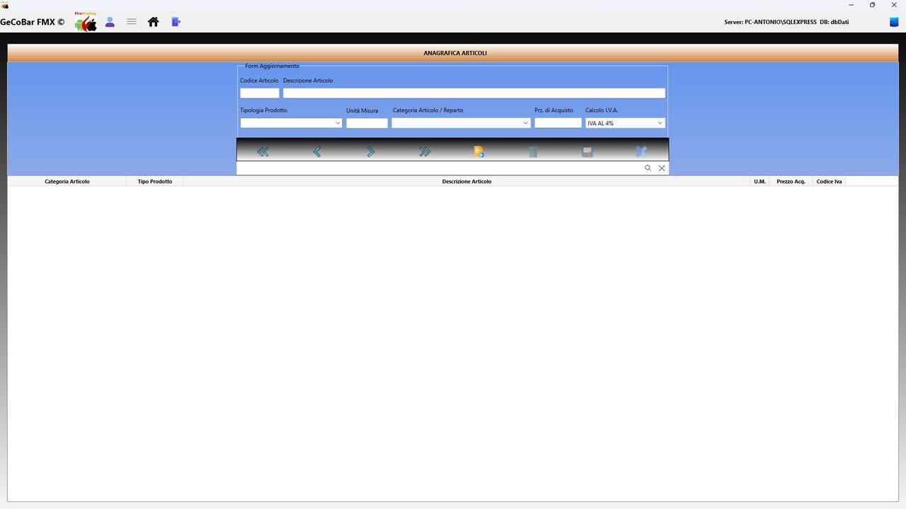
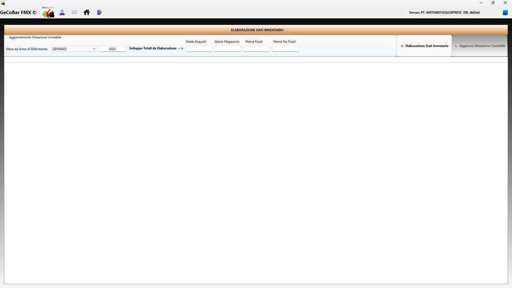

# 11. Modulo Magazzino

Gestisce tutto ciò che riguarda i prodotti trattati dall'attività: il loro archivio anagrafico, la rilevazione fisica delle giacenze tramite l'inventario, e le elaborazioni periodiche che aggiornano i dati di magazzino in modo coerente con la contabilità.

## 1. Anagrafica Articoli

Catalogo completo di tutti i prodotti trattati. Per ogni articolo:

- Codice articolo — identificativo univoco, assegnato automaticamente.
- Descrizione — nome commerciale usato in tutto il sistema.
- Categoria — classificazione merceologica da elenco configurabile.
- Unità di misura — pezzi, kg, litri, confezioni, ecc.
- Tipo prodotto — Tabacchi, Alimentari o altro. Influisce sul calcolo degli aggi e sull'imputazione delle spese.
- Codice IVA — aliquota IVA applicabile, proposta automaticamente nelle spese e nelle righe fattura.
- Prezzo di acquisto corrente — aggiornato automaticamente ad ogni acquisto registrato nel Modulo Cassa.
- Prezzo di acquisto precedente — conservato per il confronto e il rilevamento delle variazioni di costo.
- Data dell'ultimo acquisto — data in cui è stato registrato l'ultimo acquisto.

Una barra di ricerca filtra l'archivio per descrizione in tempo reale. Un pulsante di reset ripristina la visualizzazione completa.

*Fig. 25 — Anagrafica Articoli — form di inserimento*

## 2. Inventario

Sezione dedicata alla rilevazione fisica delle giacenze, tipicamente eseguita a fine anno. All'inserimento di un nuovo record il sistema preimposta data, mese/anno di riferimento, codice IVA "ES" (esente) e flag elaborazione = 0.

Inserendo il codice articolo, il sistema lo verifica nell'anagrafica e precompila automaticamente descrizione, prezzo corrente, categoria e unità di misura. L'imponibile e il totale riga vengono calcolati automaticamente appena si inserisce la quantità.

Ogni riga ha un flag di elaborazione che indica se è stata già importata come spesa di cassa. Questo impedisce che la stessa merce venga contabilizzata due volte.

## 3. Elaborazione dati

Sezione dedicata alle elaborazioni periodiche che trasformano i dati grezzi dell'inventario in informazioni utili per le statistiche. La funzione principale aggiorna le statistiche di inventario tramite stored procedure, calcolando il venduto reale come differenza tra acquistato e giacenza finale.

Questo calcolo è particolarmente importante per i prodotti in concessione: per questi il "venduto" si calcola indirettamente come differenza tra quanto caricato in magazzino e quanto rimasto a fine anno, dato fondamentale per la rendicontazione verso i fornitori istituzionali.

*Fig. 26 — Elaborazione Dati Inventario — chiusura di fine anno*
