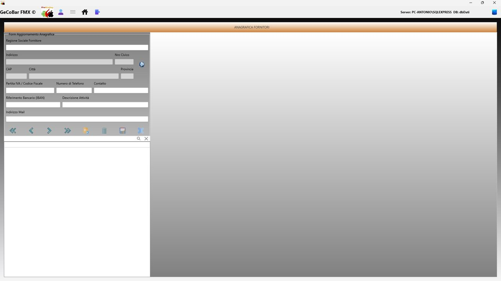
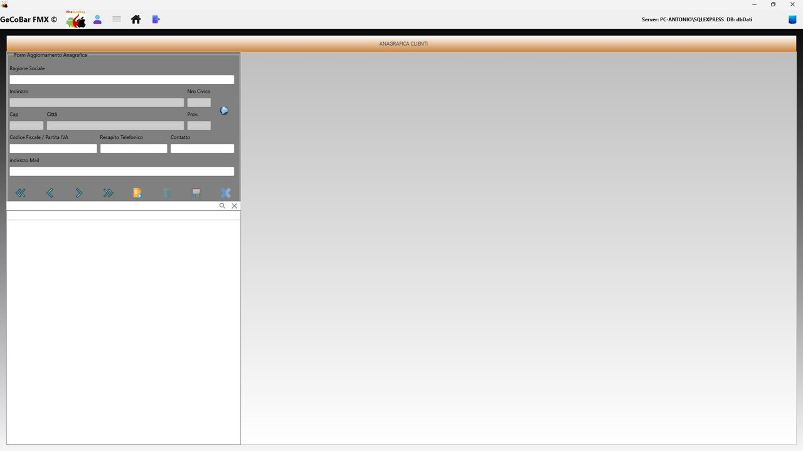
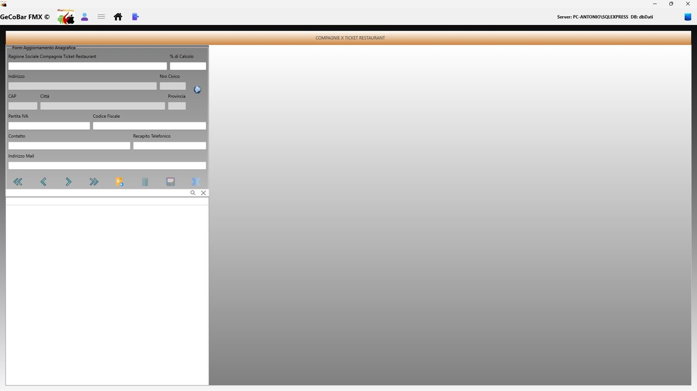

# 12. Tabelle di configurazione

⚠️  Nota importante — Integrità dei dati

I record contenuti nelle tabelle di configurazione non possono essere eliminati. Ogni voce presente in queste tabelle è collegata alle registrazioni contabili e amministrative dell'applicazione: eliminarla comprometterebbe l'integrità dei dati storici e la correttezza di tutte le elaborazioni statistiche ed economiche che vi fanno riferimento.

La cancellazione è intenzionalmente disabilitata a livello applicativo e protetta a livello di database. È possibile modificare la descrizione o i parametri di un codice esistente e aggiungere nuove voci, ma nessun record può essere cancellato, né dall'interfaccia né tramite operazioni dirette sul database.

Questa scelta progettuale garantisce la continuità e la coerenza dei dati storici nel tempo: ogni codice spesa, codice IVA, codice AGGI o qualsiasi altra voce di configurazione che abbia partecipato anche a una sola registrazione resterà sempre referenziabile e consultabile, anche a distanza di anni, senza rischio di perdita di informazioni o di incoerenza nei totali contabili.

Area riservata alla configurazione del sistema, accessibile agli utenti con privilegi elevati. Le impostazioni qui definite influenzano il comportamento di tutto il programma.

- Codici IVA — aliquote IVA utilizzabili nelle spese e nelle fatture, con descrizione e percentuale di calcolo.
- Codici spesa — categorie e capitoli di spesa per la classificazione delle uscite di cassa.
- Aggi e provvigioni — percentuali di aggio applicate ai prodotti in concessione (monopolio, francobolli, schede telefoniche, biglietti ATM) con le relative date di decorrenza. Ogni variazione viene applicata automaticamente ai calcoli della cassa dalla data configurata.
- Codici spese cassa — voci di spesa utilizzabili nel registro spese giornaliero.
- Causali prelievi — elenco delle causali disponibili per i prelievi di cassa.
- Compagnie ticket — anagrafica delle compagnie emittenti buoni pasto con le relative percentuali di commissione.

*Fig. 27 — Anagrafica Fornitori*

*Fig. 28 — Anagrafica Clienti*

*Fig. 29 — Compagnie Ticket Restaurant*
